# Phân Loại Kích Cỡ Cua Biển Tự Động Sử Dụng YOLOv11n-seg: Nghiên Cứu Tại Ngành Nuôi Trồng Thủy Sản Việt Nam

## Tóm tắt  
Nghiên cứu này đề xuất một hệ thống tự động phân loại kích cỡ cua biển sử dụng mô hình YOLOv11n-seg, nhằm nâng cao hiệu quả trong ngành nuôi trồng thủy sản Việt Nam, đặc biệt tại Đồng bằng sông Cửu Long. Hệ thống tích hợp thiết bị ESP32-CAM để thu thập ảnh và Raspberry Pi 4 để xử lý, đạt độ chính xác tổng thể 97,8% với thời gian xử lý dưới 100ms mỗi ảnh. Mô hình được huấn luyện trên tập dữ liệu gồm 720 ảnh, ghi nhận các chỉ số hiệu suất cao (mAP@0.5 cho mask: 0,9945; F1-score: 0,99). Tuy nhiên, hệ thống còn hạn chế trong việc phát hiện lớp nền và nhạy cảm với điều kiện môi trường. Các khuyến nghị bao gồm mở rộng tập dữ liệu và phát triển khả năng phân loại đa góc.

## 1. Giới thiệu  
Ngành nuôi trồng thủy sản tại Đồng bằng sông Cửu Long, Việt Nam, đóng vai trò quan trọng trong nền kinh tế, với sản lượng cua biển (Scylla serrata) tại Trà Vinh đạt 6.667 tấn mỗi năm (Sở Nông nghiệp và Phát triển nông thôn Trà Vinh, 2023). Phân loại kích cỡ cua là yếu tố then chốt trong xuất khẩu, khi giá trị sản phẩm có thể chênh lệch 25–40% tùy theo kích cỡ. Tuy nhiên, phương pháp phân loại thủ công hiện nay tốn nhiều thời gian, chi phí lao động cao và dễ xảy ra sai sót.  

Nghiên cứu này phát triển một hệ thống tự động phân loại kích cỡ cua biển sử dụng YOLOv11n-seg, một mô hình học sâu tiên tiến, nhằm giảm chi phí lao động, tăng độ chính xác và nâng cao giá trị sản phẩm xuất khẩu. Mục tiêu chính bao gồm: (1) xây dựng hệ thống thời gian thực, (2) tối ưu hóa hiệu quả phân loại, và (3) hỗ trợ ngành thủy sản đáp ứng tiêu chuẩn xuất khẩu.

## 2. Phương pháp nghiên cứu  

### 2.1 Thu thập và xử lý dữ liệu  
Tập dữ liệu gồm 720 ảnh được thu thập tại các trang trại cua ở Trà Vinh và Cà Mau, sử dụng thiết bị ESP32-CAM. Ảnh được chụp trong điều kiện ánh sáng kiểm soát (khoảng cách 30–40 cm, hỗ trợ đèn LED) và xử lý như sau:  
- Điều chỉnh kích thước ảnh về 1024×768 pixel.  
- Gán nhãn phân đoạn (lớp: Crab, Reference) bằng công cụ LabelMe.  
- Tăng cường dữ liệu thông qua xoay, lật và điều chỉnh độ sáng (không áp dụng zoom hoặc cắt).  

Hình ảnh minh họa:  
- Thiết lập hồ: 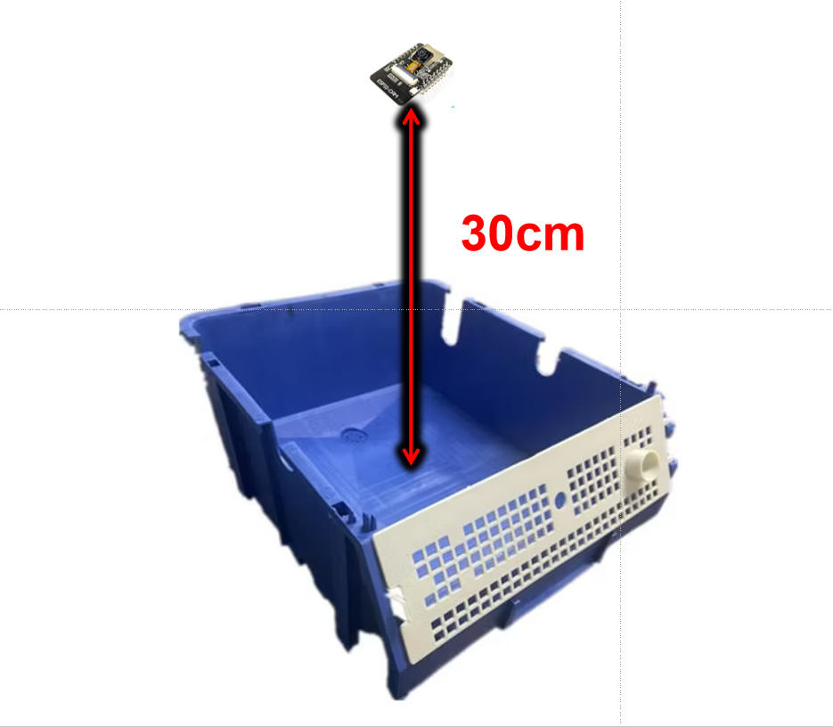  
- Ảnh mẫu thu thập: 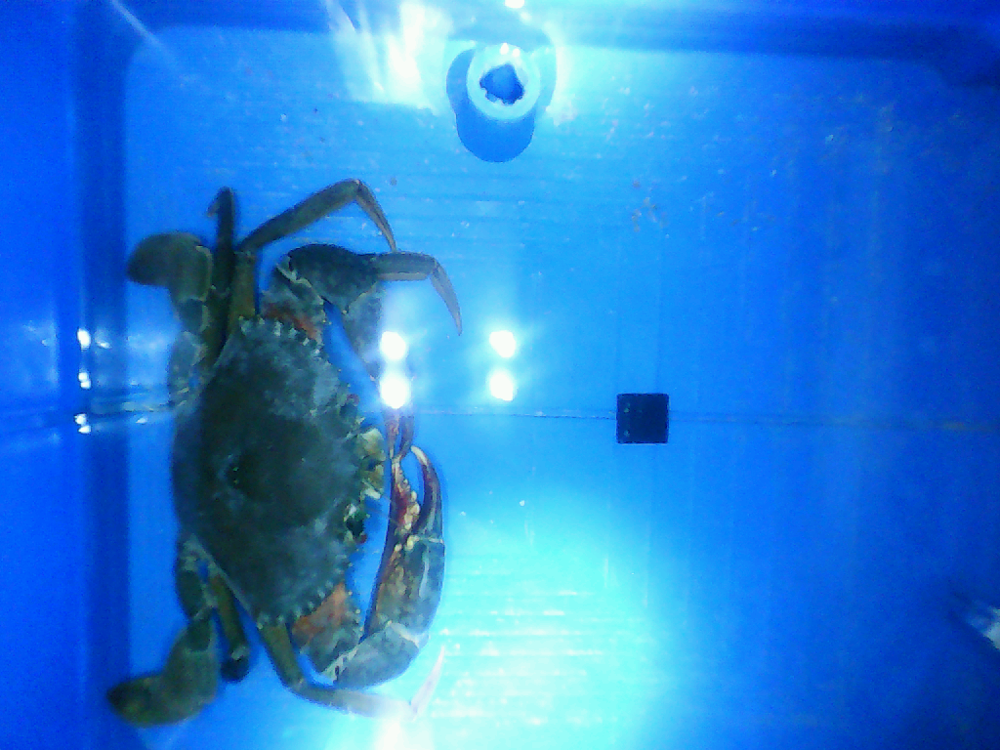  
- Ảnh mẫu đã gán nhãn: 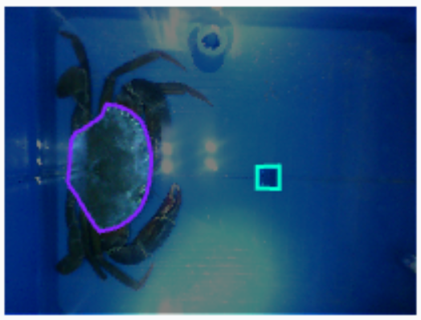  

### 2.2 Kiến trúc mô hình  
Hệ thống sử dụng YOLOv11n-seg để nhận diện và phân đoạn, triển khai trên Raspberry Pi 4. ESP32-CAM thu thập ảnh và truyền qua WiFi để xử lý. Quy trình gồm các bước:  
1. Phân đoạn vùng mai cua và vật tham chiếu (20×20 mm) bằng YOLOv11n-seg.  
2. Tính toán chiều rộng mai cua dựa trên tỷ lệ với vật tham chiếu.  
3. Phân loại cua vào các hạng kích cỡ (Y7, Y5, Y3, Y4, Xô) theo chiều rộng mai.  

Hình ảnh minh họa vật tham chiếu: 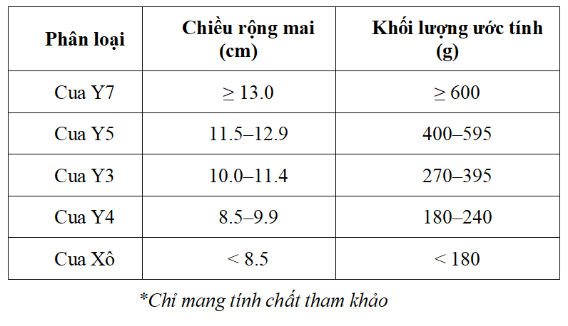  

### 2.3 Huấn luyện mô hình  
Mô hình được huấn luyện trên GPU NVIDIA RTX 3060, sử dụng PyTorch và Ultralytics CLI:  
- **Phân chia dữ liệu**: 88% huấn luyện, 8% xác thực, 4% kiểm tra.  
- **Tham số huấn luyện**: Batch size 32, 100 epoch, dừng sớm nếu không cải thiện sau 10 epoch, tỷ lệ học tự động.  
- **Chỉ số đánh giá**: IoU, mAP@0.5, mAP@0.5:0.95, Precision, Recall, F1-score.  

## 3. Kết quả  

### 3.1 Hiệu suất mô hình  
Hai mô hình được đánh giá: mô hình ảnh màu và mô hình ảnh xám.  

#### Mô hình ảnh màu  
Hình ảnh minh họa:   
- **Precision (B)**: Tăng từ 0,0059 (epoch 1) lên ~0,95 (epoch 47); ổn định ở mức 0,98–1,0 từ epoch 9.  
- **Recall (B)**: Giảm từ 0,98276 (epoch 1) xuống 0,5 (epoch 3), sau đó tăng lên ~0,9 ; ổn định ở mức 0,965–1,0 từ epoch 9.  
- **mAP@0.5 (B)**: Đạt 0,823; tăng từ 0,4195 (epoch 1) lên 0,9945 (epoch 14), duy trì ~0,99 từ epoch 14.  
- **mAP@0.5:0.95 (B)**: Ổn định ở 0,7; tăng từ 0,43797 (epoch 1) lên 0,91569 (epoch 43), dao động nhẹ.  
- **Precision và Recall (M)**: Đạt ~0,98–1,0 từ epoch 9.  
- **mAP@0.5 (M)**: Đạt 0,85; tăng từ 0,50012 (epoch 1) lên 0,9945 (epoch 14), duy trì ~0,99 từ epoch 14.  
- **mAP@0.5:0.95 (M)**: Ổn định ở 0,65; tăng từ 0,43797 (epoch 1) lên 0,795 (epoch 34), dao động quanh 0,74–0,79.  
- **Phân tích loss**:  
  - Train Box Loss: Giảm từ 1,23602 (epoch 1) xuống 0,48049 (epoch 47).  
  - Train Segmentation Loss: Giảm từ 2,73355 (epoch 1) xuống 0,66682 (epoch 47).  
  - Train Classification Loss: Giảm từ 3,39483 (epoch 1) xuống 0,35816 (epoch 47).  
  - Train DFL Loss: Giảm từ 1,4493 (epoch 1) xuống 0,85444 (epoch 47).  
  - Validation Loss: Giảm tương ứng, nhưng val/seg_loss có dao động.  
- **Learning Rate**: Giảm từ 0,00031673 (epoch 1) xuống 0,000907848 (epoch 47).  
- **Nhận xét**: Mô hình đạt hiệu suất cao, với Precision, Recall, và mAP@0.5 gần 0,99–1,0 từ epoch 14, không có dấu hiệu overfitting.  

#### Mô hình ảnh xám  
Hình ảnh minh họa:   
- **Precision (B)**: Tăng từ 0,00685 (epoch 1) lên 0,97365 (epoch 38); ổn định quanh 0,96–0,98 từ epoch 9.  
- **Recall (B)**: Giảm từ 0,98684 (epoch 1) xuống 0,01876 (epoch 5), sau đó tăng lên 0,9696 (epoch 38); ổn định ở 0,94–1,0 từ epoch 9.  
- **mAP@0.5 (B)**: Tăng từ 0,40464 (epoch 1) lên 0,9865 (epoch 38); đạt ~0,98–0,99 từ epoch 9.  
- **mAP@0.5:0.95 (B)**: Tăng từ 0,23335 (epoch 1) lên 0,88854 (epoch 38), dao động, chưa ổn định ở 0,7.  
- **Precision và Recall (M)**: Đạt ~0,94–0,99 từ epoch 9.  
- **mAP@0.5 (M)**: Tăng từ 0,41072 (epoch 1) lên 0,98522 (epoch 38); đạt ~0,98–0,99 từ epoch 9.  
- **mAP@0.5:0.95 (M)**: Tăng từ 0,28948 (epoch 1) lên 0,74391 (epoch 38), dao động, chưa ổn định ở 0,65.  
- **Phân tích loss**:  
  - Train Box Loss: Giảm từ 1,45957 (epoch 1) xuống 0,52831 (epoch 38).  
  - Train Segmentation Loss: Giảm từ 2,93753 (epoch 1) xuống 0,68867 (epoch 38).  
  - Train Classification Loss: Giảm từ 3,56136 (epoch 1) xuống 0,41745 (epoch 38).  
  - Train DFL Loss: Giảm từ 1,55846 (epoch 1) xuống 0,86455 (epoch 38).  
  - Validation Loss: Giảm tương ứng, nhưng val/seg_loss và val/box_loss dao động mạnh (lên 9,21518 tại epoch 6).  
- **Learning Rate**: Giảm từ 0,00031673 (epoch 1) xuống 0,00105638 (epoch 38).  
- **Nhận xét**: Hiệu suất cao nhưng chưa đạt mục tiêu (Precision/Recall ~0,9; mAP@0.5:0.95 ổn định ở 0,7/0,65).  

Hình ảnh huấn luyện: 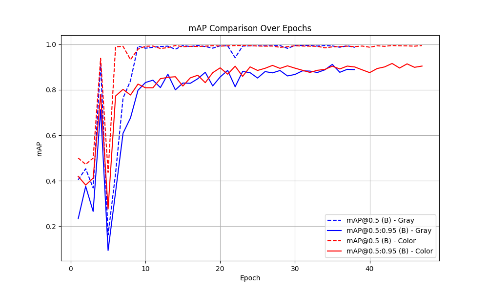  

### 3.2 Phân tích mất mát (Loss)  
- **Mô hình ảnh màu** :  
  - Train Box Loss: Giảm từ 1,2 xuống 0,4.  
  - Validation Box Loss: Giảm từ 0,64 xuống 0,4.  
  - Train Segmentation Loss: Giảm từ 2,73 xuống 0,4.  
  - Validation Segmentation Loss: Giảm từ 0,91 xuống 0,59.  
  - **Nhận xét**: Loss giảm ổn định, không có dấu hiệu overfitting.  
- **Mô hình ảnh xám** :  
  - Train Box Loss: Giảm từ 1,45 xuống 0,52.  
  - Validation Box Loss: Giảm từ 0,97 xuống 0,44.  
  - Train Segmentation Loss: Giảm từ 2,93 xuống 0,68.  
  - Validation Segmentation Loss: Giảm từ 3,22 xuống 0,62.  
  - **Nhận xét**: Loss cao hơn mô hình ảnh màu do thiếu thông tin màu sắc.  
- **So sánh**: Mô hình ảnh màu vượt trội nhờ khai thác thông tin màu sắc.  

### 3.3 Ma trận nhầm lẫn (Confusion Matrix)  
- **Mô hình ảnh màu** 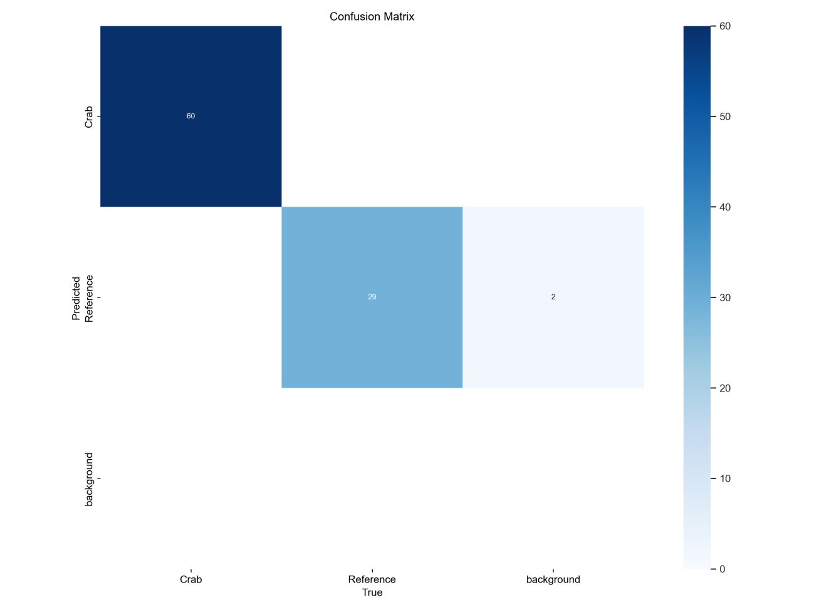:  
  - **Crab**: TP = 60, FN = 0, FP = 0; Precision = 1,0, Recall = 1,0, F1-score = 1,0.  
  - **Reference**: TP = 29, FN = 0, FP = 2; Precision = 0,9355, Recall = 1,0, F1-score = 0,9667.  
  - **Background**: TP = 0, FN = 2, FP = 0; Precision = 0, Recall = 0, F1-score = 0.  
  - **Accuracy**: 0,978.  
- **Mô hình ảnh xám** 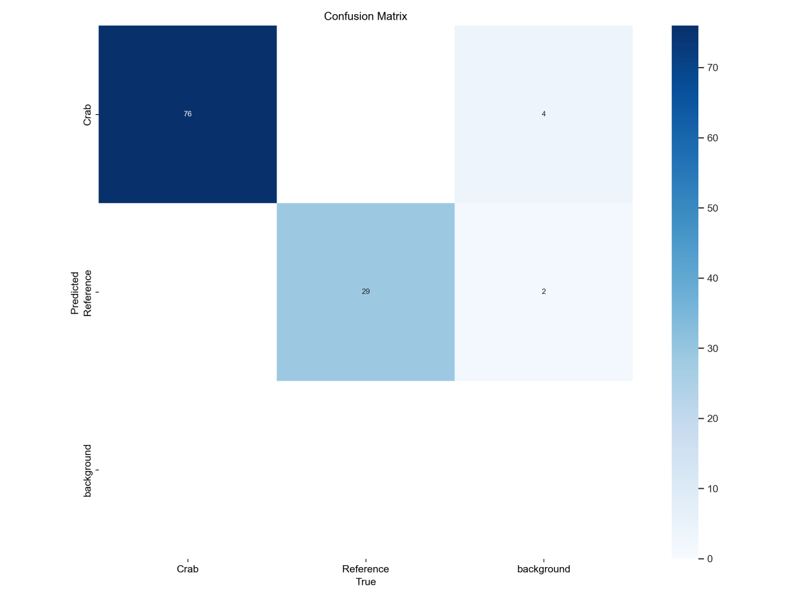:  
  - **Crab**: TP = 76, FN = 0, FP = 4; Precision = 0,95, Recall = 1,0, F1-score = 0,9744.  
  - **Reference**: TP = 29, FN = 0, FP = 2; Precision = 0,9355, Recall = 1,0, F1-score = 0,9667.  
  - **Background**: TP = 0, FN = 6, FP = 0; Precision = 0, Recall = 0, F1-score = 0.  
  - **Accuracy**: 0,946.  

### 3.4 Lựa chọn mô hình  
- **Mô hình được chọn**: Mô hình ảnh màu.  
- **Lý do**:  
  - mAP@0.5 (Bounding Box): 0,91569 (epoch 43).  
  - mAP@0.5 (Mask): 0,9945.  
  - F1-score (Mask): 0,99 (@confidence 0,589).  
- **Đánh giá**: Mô hình ảnh màu vượt trội ở khả năng phân loại và phân đoạn, đặc biệt với lớp Crab và Reference.  

### 3.5 Kiểm thử  
Mô hình ảnh màu được kiểm thử trong điều kiện thực tế:  
- **IoU cho phân đoạn cua**: 0,89–0,92.  
  - **Model ảnh màu đã chọn**:  
    + Lần 1: 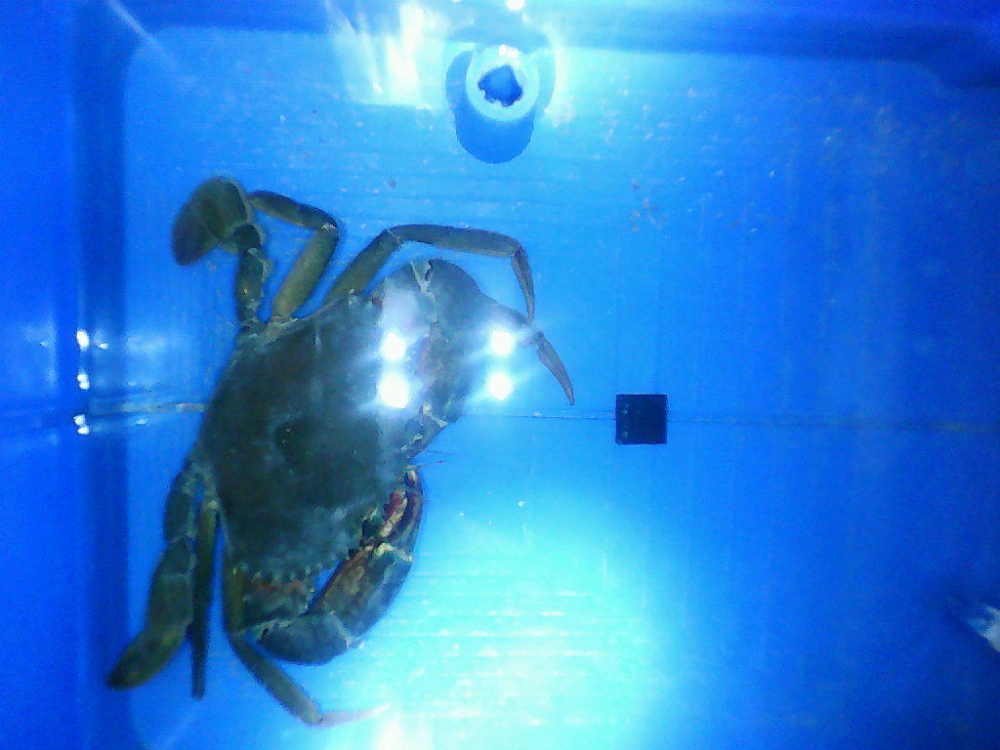 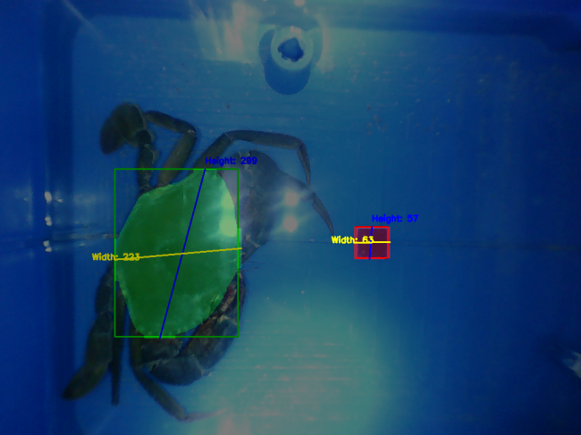  
    + Lần 2: 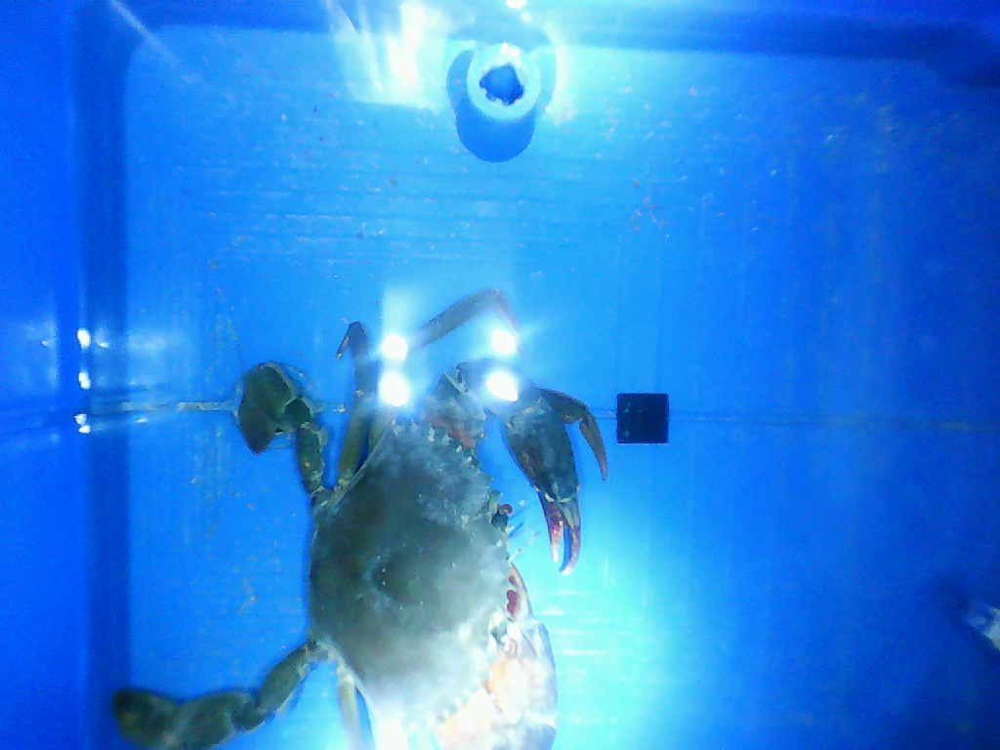 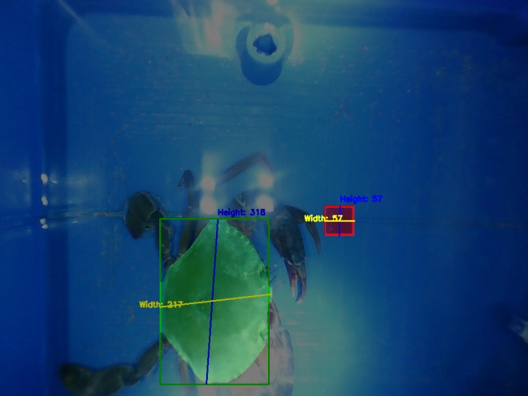  
    + Lần 3:  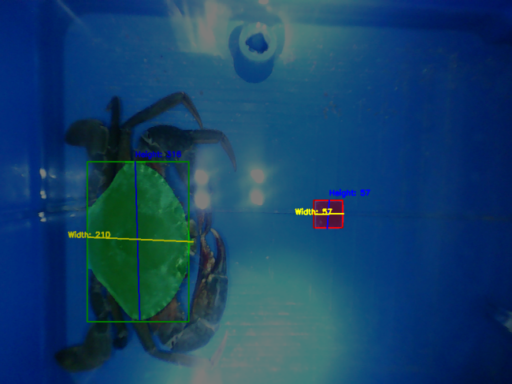  
  - **Model ảnh xám đã loại**:  
    + Lần 1:  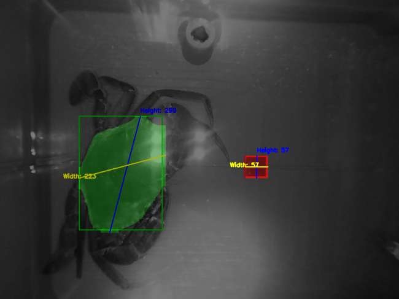  
    + Lần 2:  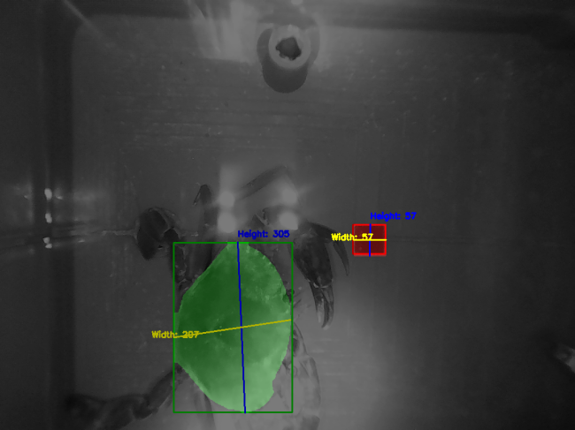  
    + Lần 3:  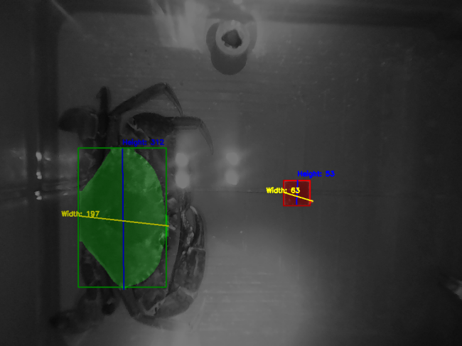  
- **Đánh giá**:  
  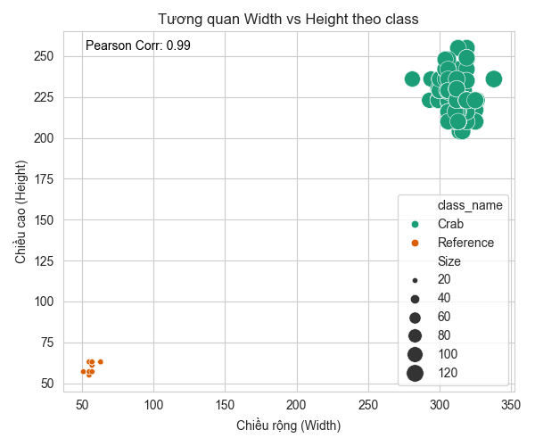 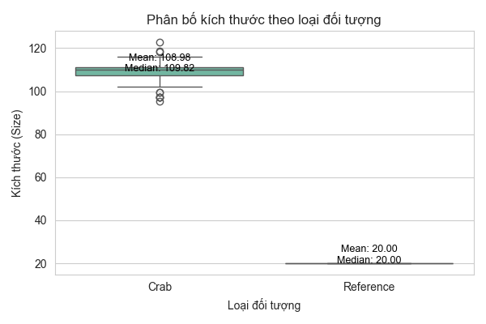  
- **Phân loại kích cỡ**: Sai số đo lường tương đối 23,5%, dẫn đến phân loại không nhất quán (một con cua bị phân loại thành Y5, Y3 và Y4).  
  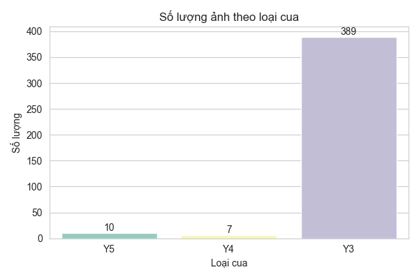 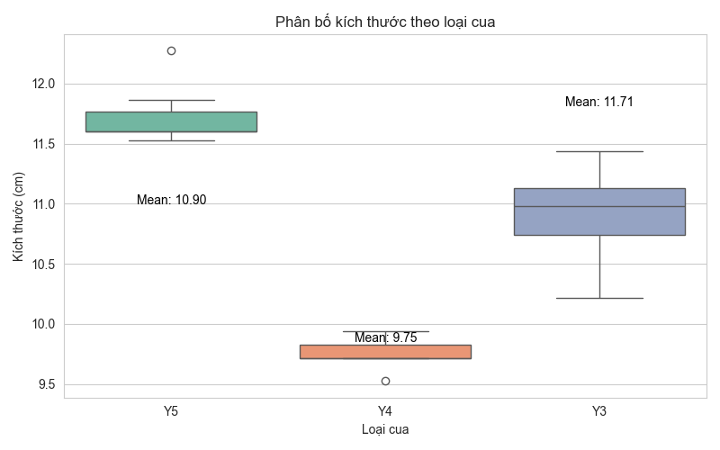  
- **Đánh giá**:  
Mô hình được kiểm thử trên tập dữ liệu gồm 405 ảnh tại cùng một hộp nuôi, nhưng sau khi phân loại, kết quả cho thấy một con cua bị phân loại thành 3 kích cỡ khác nhau. Nguyên nhân chính là do hiệu ứng "cánh bướm": sau khi khoanh vùng, đã xuất hiện sai số điểm ảnh giữa các ảnh, dẫn đến việc xác định điểm chiều dài và chiều rộng không ổn định và thiếu chính xác. Hơn nữa, khi ánh xạ lên bản so sánh, sai số tiếp tục gia tăng tại ranh giới giữa hai kích cỡ cua (ví dụ: 9,9 cm so với 10 cm giữa Y3 và Y4), gây ra sai số kích cỡ dao động 23,5%. Tuy nhiên, sai số phân loại thực tế chỉ đạt 0,04%, tương ứng với 17/405 lần kiểm thử sai.  
## 4. Thảo luận  
Hệ thống chứng minh tiềm năng trong tự động hóa phân loại kích cỡ cua, với độ chính xác cao và khả năng xử lý thời gian thực. Tuy nhiên, các thách thức bao gồm:  
- Hiệu suất kém trên lớp Background do mất cân bằng dữ liệu (Crab: 60–76 mẫu, Reference: 29 mẫu).  
- Nhạy cảm với điều kiện ánh sáng và tư thế cua.  
- Sai số đo lường gần ngưỡng phân loại (ví dụ: 10,9 cm so với 11 cm).  

**Khuyến nghị cải tiến**:  
- Thu thập tập dữ liệu lớn hơn, đa dạng hơn.  
- Triển khai chụp ảnh đa góc và tái tạo 3D để tăng độ chính xác.  
- Điều chỉnh ngưỡng phân loại để giảm sai số.  

## 5. Kết luận  
Hệ thống dựa trên YOLOv11n-seg đã tự động hóa thành công quá trình phân loại kích cỡ cua biển, đạt độ chính xác 97,8% và hiệu suất thời gian thực. Đây là giải pháp tiết kiệm chi phí, hỗ trợ giảm chi phí lao động và nâng cao giá trị xuất khẩu cho ngành thủy sản Việt Nam. Các nghiên cứu tiếp theo nên tập trung vào cải thiện khả năng xử lý trong điều kiện môi trường bất lợi và tích hợp thêm các chỉ số chất lượng cua.

## Tài liệu tham khảo  
- Sở Nông nghiệp và Phát triển nông thôn Trà Vinh, 2023. Báo cáo sản lượng cua biển.  
- Ultralytics, 2024. Tài liệu YOLOv11n-seg.  
- Redmon, J. et al., 2016. You Only Look Once: Unified, Real-Time Object Detection.